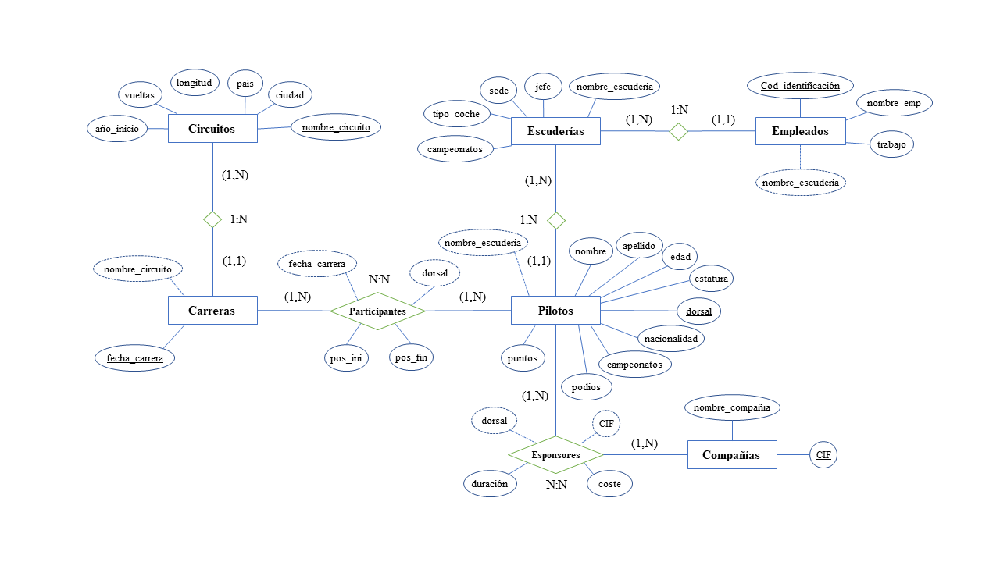

# F1 Database
The task is to create a database to store information about the 2021 Formula 1 championship. This includes data on drivers, circuits, teams, employees, and sponsor companies. The process involves creating an entity-relationship model, describing tables with attributes, performing logical design, normalization, and finally creating tables in PostgreSQL. All the information is sourced from the official F1 website for the 2021 season except for the employee data, which is hypothetical.

## Authors

- [Cristian Morillo Losada](https://www.github.com/cristian8data)

## Entity-relationship model

